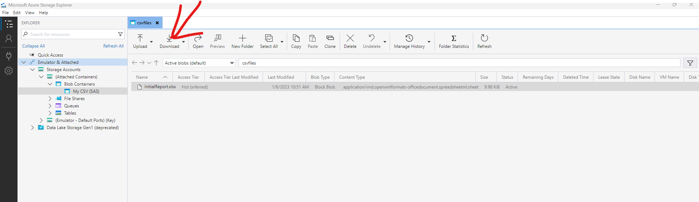

# Transfering Files Via Storage Account

## Requirments

### Client

* Azure Subscrinstrion
* Storage Account with Contributor Access or ability to create new storage account

### Engineer 

Azure Storage Explorer App Installed

## Create Azure Storage Account

* Instruct client to start creating storage account [using Azure Documentation](https://learn.microsoft.com/en-us/azure/storage/common/storage-account-create?tabs=azure-portal#create-a-storage-account-1)

* At the configuration screen select "Locally-redundand storage" to save costs and then click Review + Create

## Configure Network Firewall Settings 

* Navigate to the newly created account and select Networking
* Select "Enable from Selected Virtual Networks and Ip Addresses"
* Add your external IP [here is how to find]() and client's external IP which can be found on the page
* Save Configiration

## Create Contauner and upload reports

* Navigate to the container section and click "+ Container"

* Create a new container 

* Click Upload buttion to get Upload files dialog

* Click on a folder button and navigate to the reports section

## Create SAS token for access

* Click on 'Shared Access Token' while still inside the container

* Select Read + List rights in the drop down
* Select Start and Expiry times
* Optional: add your ( engineer)  public IP address in the box
* Click "Generate SAS Token and URL"

* Once URL is generated save the "Blob SAS Url" value

## Download report with Azure Storage Explorer

* Start Azure Storage Explorer
* Click on connect button

* Select "Blob container" at the next dialog window

* Select "Shared Access Signature URL" and click Next

* Provide connection name, paste SAS URL obtained in the steps above and click "Next"

* Use Donwload button to download reports to your computer

